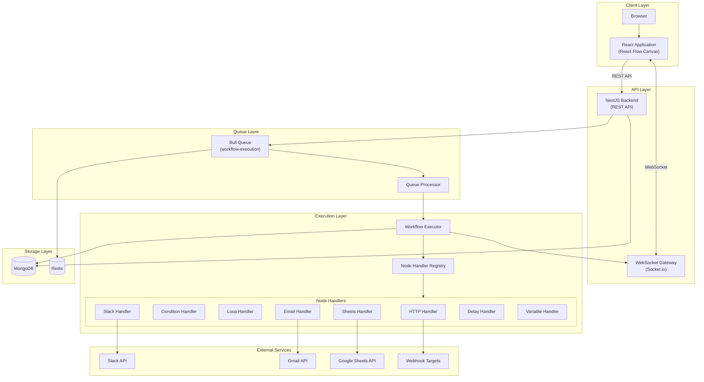
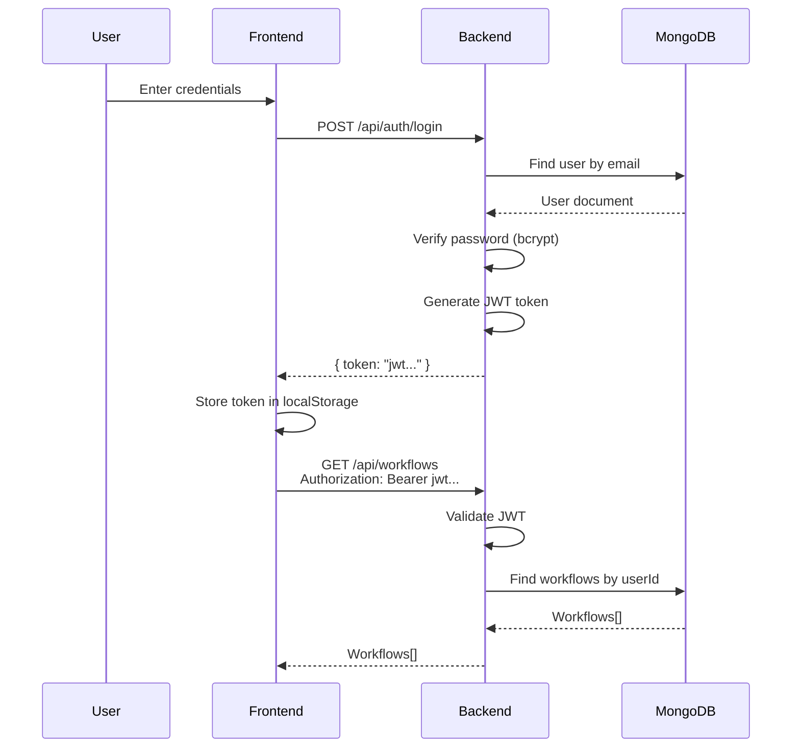
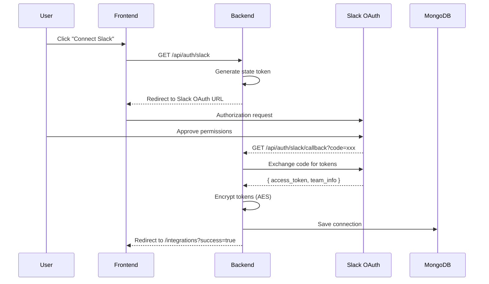
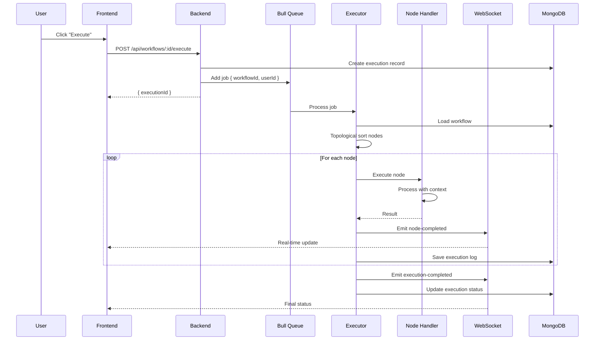
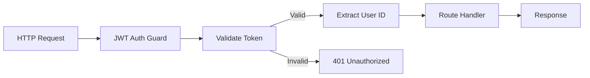
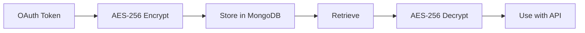
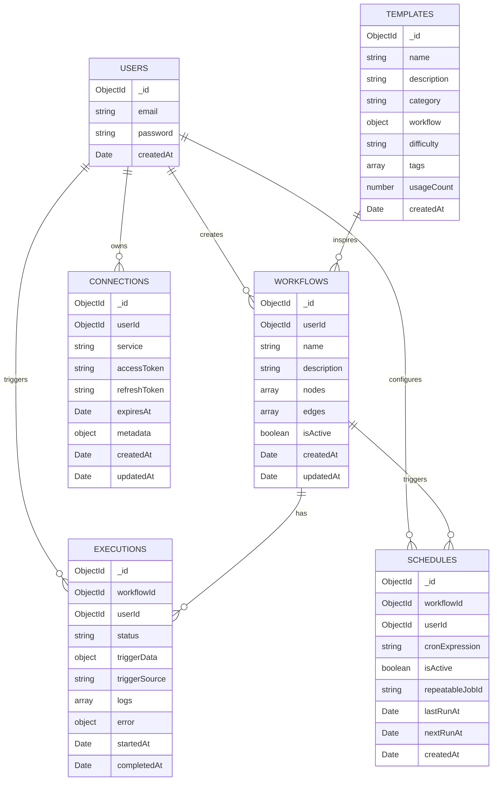
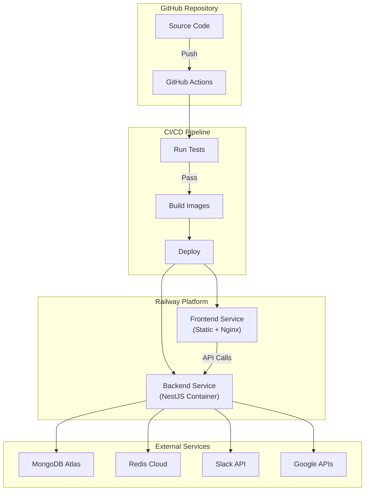

# FlowForge Architecture

This document describes the system architecture, component interactions, data flows, and design decisions behind FlowForge.

## System Overview

FlowForge is a workflow automation platform built with a modern microservices-inspired architecture. The system consists of:

- **Frontend Application**: React-based SPA for visual workflow building and monitoring
- **Backend API**: NestJS REST API handling authentication, CRUD operations, and orchestration
- **Queue System**: Bull/Redis for asynchronous workflow execution with retry capabilities
- **Database**: MongoDB for persistent storage of users, workflows, executions, and credentials
- **Real-time Layer**: Socket.io for live execution updates

The architecture emphasizes:
- **Scalability**: Queue-based execution allows horizontal scaling of workers
- **Security**: Per-user OAuth token isolation with AES encryption
- **Reliability**: Retry logic and execution logging for debugging
- **Real-time UX**: WebSocket updates for live execution monitoring

## Architecture Diagram

### High-Level System Architecture



### Authentication Flow



### OAuth Connection Flow



### Workflow Execution Flow



## Component Descriptions

### Frontend (React Application)

The frontend is a single-page application built with React 18 and Vite.

| Component | Technology | Purpose |
|-----------|------------|---------|
| Workflow Canvas | React Flow | Visual drag-and-drop workflow builder |
| State Management | Zustand | Global state for auth and workflow builder |
| Server State | TanStack Query | API data fetching, caching, and synchronization |
| Real-time Updates | Socket.io Client | Live execution progress monitoring |
| Styling | Tailwind CSS | Utility-first CSS framework |
| Animations | GSAP + Motion | Smooth UI transitions |
| Notifications | react-hot-toast | Toast notifications for user feedback |

**Key Pages:**
- `WorkflowBuilder` - React Flow canvas with node palette and configuration panels
- `WorkflowsList` - Grid view of user workflows with search and filtering
- `ExecutionDetails` - Real-time execution monitoring with node-by-node logs
- `Integrations` - OAuth connection management for Slack and Google

### Backend API (NestJS)

The backend is a modular NestJS application with the following modules:

| Module | Responsibility |
|--------|----------------|
| `AuthModule` | JWT authentication, OAuth flows (Slack, Google), Passport strategies |
| `UsersModule` | User registration, profile management |
| `WorkflowsModule` | Workflow CRUD, execution triggering, node handlers |
| `ExecutionsModule` | Execution history, logs, WebSocket gateway |
| `ConnectionsModule` | OAuth token storage with encryption, token refresh |
| `SchedulesModule` | Cron-based scheduling with Bull repeatable jobs |
| `TemplatesModule` | Pre-built workflow templates with seeding |

### MongoDB

Document-oriented database storing all persistent data:

- **Users**: Account credentials and metadata
- **Workflows**: Visual workflow definitions (nodes, edges, positions)
- **Executions**: Execution history with detailed logs
- **Connections**: Encrypted OAuth tokens per user per service
- **Schedules**: Cron expressions linked to workflows
- **Templates**: Pre-built workflow definitions

### Redis

In-memory data store used for:

- **Bull Queue Storage**: Job data, state, and retry information
- **Repeatable Jobs**: Scheduled workflow trigger metadata
- **WebSocket Adapter**: Socket.io pub/sub for multi-instance support (future)

### Bull Queue

Asynchronous job processing system:

- **Queue Name**: `workflow-execution`
- **Retry Logic**: 3 attempts with exponential backoff (1s base delay)
- **Job Removal**: Completed jobs auto-removed, failed jobs preserved for debugging
- **Concurrency**: Configurable worker concurrency

### Workflow Executor

The core execution engine (`WorkflowExecutorService`):

1. Loads workflow definition from MongoDB
2. Performs topological sort on nodes based on edges
3. Initializes execution context with trigger data and variables
4. Iterates through nodes in dependency order
5. For each node:
   - Looks up handler from registry
   - Performs variable replacement on node configuration
   - Executes handler with context
   - Stores result for downstream nodes
   - Emits WebSocket events
6. Handles errors with optional `continueOnError` flag
7. Updates final execution status

### Node Handlers

Individual handlers implementing the `INodeHandler` interface:

| Handler | Description | External Dependencies |
|---------|-------------|----------------------|
| `WebhookHandler` | Processes incoming webhook trigger data | None |
| `HttpRequestHandler` | Makes HTTP requests to external APIs | Target URLs |
| `ConditionHandler` | Evaluates conditions, routes to true/false branches | None |
| `LoopHandler` | Iterates over arrays, provides `{{loop.item}}` context | None |
| `VariableHandler` | Creates/updates workflow variables | None |
| `DelayHandler` | Pauses execution for specified duration | None |
| `SlackHandler` | Sends messages to Slack channels | Slack API (OAuth) |
| `EmailHandler` | Sends emails via Gmail | Gmail API (OAuth) |
| `SheetsHandler` | Reads/appends Google Sheets data | Sheets API (Service Account) |

### Execution Gateway (WebSocket)

Socket.io gateway for real-time communication:

- **Namespace**: Default (`/`)
- **Authentication**: JWT token in connection handshake
- **Room Strategy**: Users join room `user:${userId}` for isolated updates
- **Events Emitted**: `execution:started`, `execution:progress`, `execution:node-completed`, `execution:completed`

## Data Flow

### Complete Workflow Execution Data Flow

1. **User creates workflow** in React Flow canvas (drag nodes, connect edges)
2. **Workflow saved** to MongoDB via `POST /api/workflows`
3. **User triggers execution** via `POST /api/workflows/:id/execute`
4. **Backend creates execution record** in MongoDB with status `pending`
5. **Job added to Bull queue** with `{ workflowId, userId, executionId }`
6. **Queue processor picks up job** and invokes `WorkflowExecutorService`
7. **Executor loads workflow** from MongoDB by ID
8. **Topological sort** orders nodes based on edge dependencies
9. **For each node in order**:
   - Handler retrieved from `NodeHandlerRegistry`
   - If node requires OAuth (Slack, Email), user's encrypted token fetched and decrypted
   - Variable replacement applied to node configuration (`{{variable}}` syntax)
   - Handler executed with node data and execution context
   - Result stored in context for downstream node access
   - WebSocket event emitted to user's room
   - Execution log entry saved to MongoDB
10. **Execution marked complete** (success or failed)
11. **Frontend receives WebSocket events** and updates UI in real-time

### Variable Replacement Flow

```
Input: "Hello {{trigger.name}}, your order {{variables.orderId}} is ready"
Context: { trigger: { name: "John" }, variables: { orderId: "12345" } }
Output: "Hello John, your order 12345 is ready"
```

Supported variable paths:
- `{{trigger.field}}` - Webhook/trigger payload data
- `{{variables.name}}` - User-defined variables
- `{{nodeId.field}}` - Output from previous node by ID
- `{{loop.item}}` - Current loop iteration item
- `{{loop.index}}` - Current loop iteration index (0-based)

## Security Architecture

### Authentication Layer



| Security Feature | Implementation |
|-----------------|----------------|
| Password Hashing | bcrypt with salt rounds |
| API Authentication | JWT tokens (HS256) |
| Token Expiration | Configurable (default 7 days) |
| Protected Routes | NestJS Guards with `@UseGuards(JwtAuthGuard)` |
| WebSocket Auth | JWT in handshake query params |

### OAuth Token Security



| Security Feature | Implementation |
|-----------------|----------------|
| Encryption Algorithm | AES-256 via crypto-js |
| Encryption Key | 32-character hex string from environment |
| Token Isolation | Tokens filtered by `userId` in all queries |
| Token Refresh | Automatic refresh for Google tokens before expiration |

### Multi-Tenant Isolation

- Each user can only access their own:
  - Workflows (`userId` filter on all queries)
  - Executions (`userId` filter)
  - OAuth Connections (`userId` filter)
  - Schedules (`userId` filter)
- WebSocket events sent only to user's room (`user:${userId}`)
- No cross-user data leakage possible at the API level

## Database Schema

### Collections Overview



### Collection Details

#### users
```javascript
{
  _id: ObjectId,
  email: String (unique, indexed),
  password: String (bcrypt hashed),
  createdAt: Date
}
```

#### workflows
```javascript
{
  _id: ObjectId,
  userId: ObjectId (indexed),
  name: String,
  description: String,
  nodes: [{
    id: String,
    type: String (webhook|http|condition|loop|variable|delay|slack|email|sheets),
    position: { x: Number, y: Number },
    data: Object (node-specific configuration)
  }],
  edges: [{
    id: String,
    source: String (node ID),
    target: String (node ID),
    sourceHandle: String (optional, for condition branches)
  }],
  isActive: Boolean,
  createdAt: Date,
  updatedAt: Date
}
```

#### executions
```javascript
{
  _id: ObjectId,
  workflowId: ObjectId (indexed),
  userId: ObjectId (indexed),
  status: String (pending|running|completed|failed),
  triggerData: Object,
  triggerSource: String (manual|webhook|scheduled),
  logs: [{
    nodeId: String,
    nodeType: String,
    status: String (success|error|skipped),
    message: String,
    output: Object,
    timestamp: Date
  }],
  error: { message: String, stack: String },
  startedAt: Date,
  completedAt: Date
}
```

#### connections
```javascript
{
  _id: ObjectId,
  userId: ObjectId (indexed),
  service: String (slack|google),
  accessToken: String (AES encrypted),
  refreshToken: String (AES encrypted),
  expiresAt: Date,
  metadata: {
    teamName: String,      // Slack
    teamId: String,        // Slack
    email: String,         // Google
    scope: String
  },
  createdAt: Date,
  updatedAt: Date
}
```

#### schedules
```javascript
{
  _id: ObjectId,
  workflowId: ObjectId (indexed),
  userId: ObjectId (indexed),
  cronExpression: String,
  isActive: Boolean,
  repeatableJobId: String (Bull job reference),
  lastRunAt: Date,
  nextRunAt: Date,
  createdAt: Date
}
```

#### templates
```javascript
{
  _id: ObjectId,
  name: String,
  description: String,
  category: String (notifications|data-sync|monitoring|marketing),
  workflow: Object (embedded workflow definition),
  difficulty: String (beginner|intermediate|advanced),
  tags: [String],
  usageCount: Number,
  createdAt: Date
}
```

## Deployment Architecture

### Production Deployment



### Environment Configuration

| Environment | Backend URL | Frontend URL | Database |
|-------------|-------------|--------------|----------|
| Development | localhost:3001 | localhost:5173 | Local MongoDB (Docker) |
| Production | api.flowforge.app | flowforge.app | MongoDB Atlas |

### Scaling Considerations

1. **Horizontal Scaling**: Backend can run multiple instances with shared Redis for queue
2. **Queue Workers**: Separate worker processes can be added for high-volume execution
3. **Database Indexing**: Indexes on `userId`, `workflowId` for efficient queries
4. **WebSocket Scaling**: Redis adapter for Socket.io enables multi-instance pub/sub

## Technology Decisions

| Decision | Choice | Rationale |
|----------|--------|-----------|
| Backend Framework | NestJS | TypeScript support, modular architecture, built-in DI |
| Database | MongoDB | Flexible schema for varying node configurations |
| Queue | Bull + Redis | Reliable job processing, retry support, repeatable jobs |
| Frontend Framework | React | Component-based, large ecosystem, React Flow compatibility |
| State Management | Zustand | Lightweight, TypeScript-friendly, no boilerplate |
| Real-time | Socket.io | Mature WebSocket library, room support, fallbacks |
| Styling | Tailwind CSS | Rapid development, consistent design system |
| Authentication | JWT + Passport | Stateless auth, NestJS integration |
